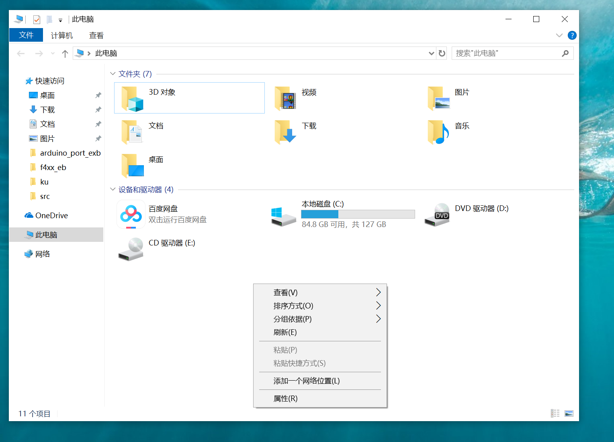
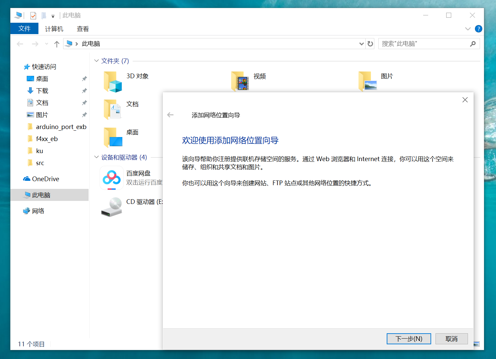
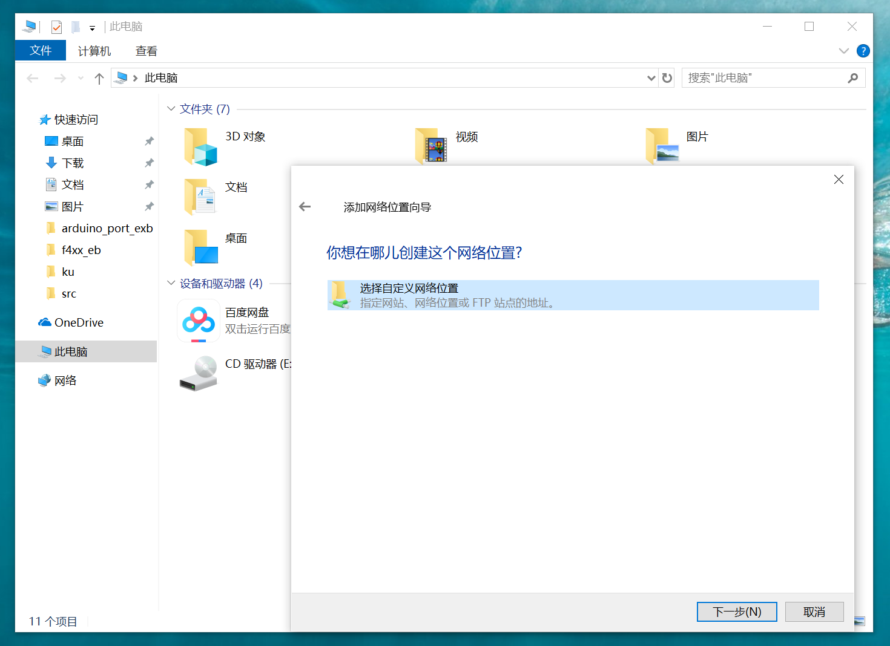
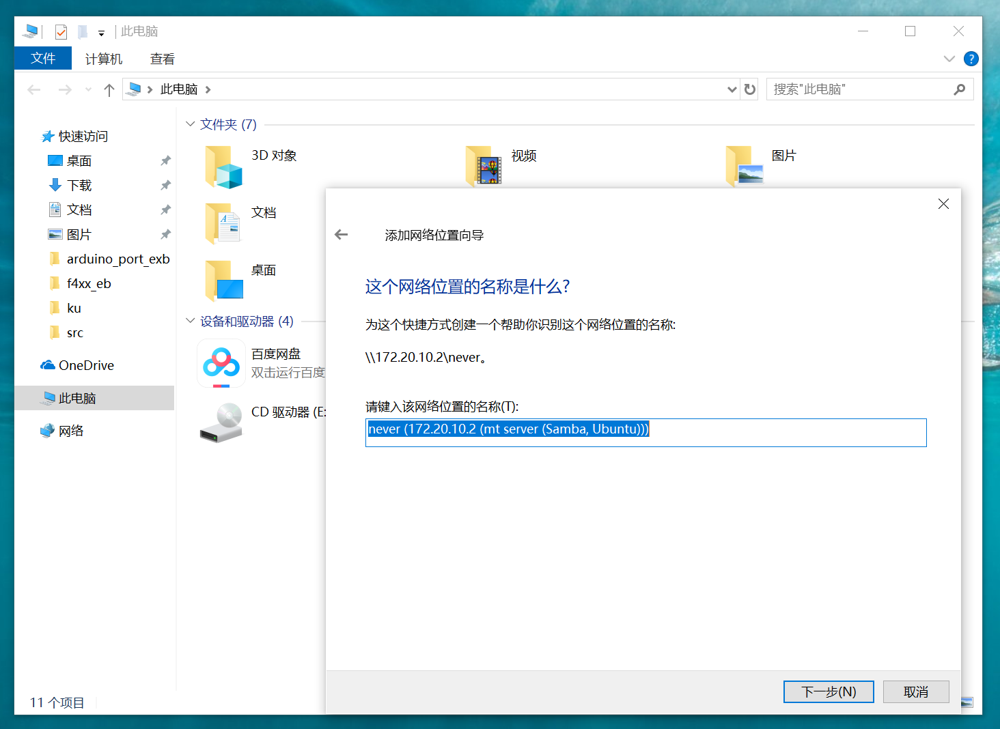
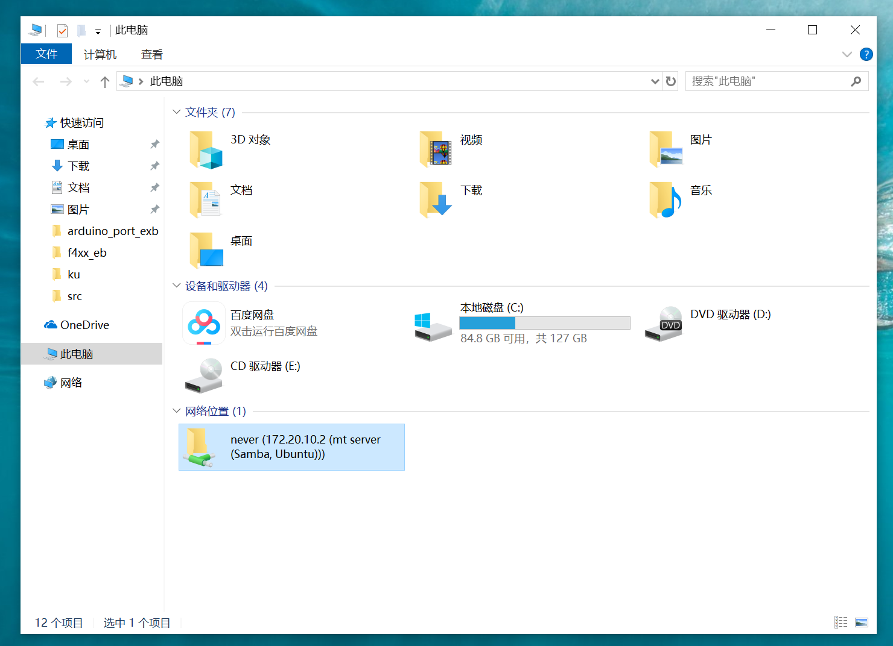

# samba
samba for Server Message Block

## 1、介绍
samba最初发展的主要目的就是用来沟通windows与uinx这两个不同的平台。时至今日，仍不少开发者需要同时用这两种平台，只是更多虚拟机与主机的方式。虚拟机与主机间的交互，一般有以下几种形式：
- 共享文件夹

- ftp服务

- samba服务

### 1.2、操作平台
Ubuntu16.04

## 2、samba常见的应用


## 3、下载与安装
### 3.1、下载
```
git clone https://github.com/neverxie/samba.git
```

### 3.2、安装samba
```
sudo apt install samba
```

### 2.2、修改配置文件
- 先备份当前smb.conf

```
sudo cp /etc/samba/smb.conf /etc/samba/smb.conf.bak
```
- 复制配置文件

```
sudo cp ./smb.conf /etc/samba/smb.conf
```

## 4、使用

### 4.1、添加用户
`sudo smbpasswd -a`
> 温馨提示：samba用户密码设置与本系统密码一致较为方便

#### 4.2、重启samba生效
```
sudo /etc/init.d/samba restart
```

### 4.2、windows设置
1. 添加一个网络位置，如图所示：




2. 指定网站的位置，如图所示：
本机ip+个人文件夹



3. 添加完毕，如图所示：

